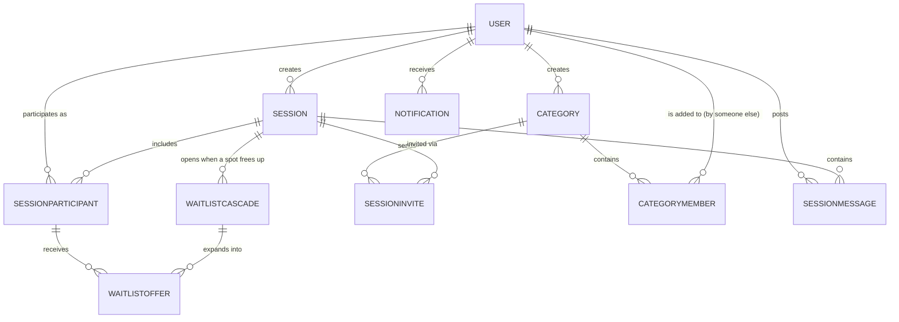

# Cliquey — MVP Spec

A social coordination layer for organizing tennis groups (starting around Sunnyvale Tennis Center & Fairbreigh Swim and Racket Club players) — not a court booking system.

## Scope note

This version deliberately does **not** integrate with either club's actual court reservation/availability system. Group "sessions" carry a time/place as plain info, not an enforced resource — the app organizes *who's playing*, not the court itself. Real slot integration is a Phase 2 effort that requires club buy-in (see bottom).

## MVP Feature List

### Accounts
- User signup/login, basic profile
- No club-membership/guest distinction needed yet — anyone can use the app

### Sessions (the "group" being organized)
- Create a session: title, session type (singles / doubles / open play — informational), date/time, location (free text or a simple club/site picker — not tied to real availability), target size
- Optional **description** field — a free-text box the creator can fill in with any extra context (skill level expectations, what to bring, etc.); not required to create a session
- Creating a session does **not** reserve anything external — it's a social commitment only
- Session has a status: open, full, cancelled, completed (moves to `completed` automatically once the date/time passes)
- The creator can edit date/time/location at any time, even with confirmed participants — doing so notifies every confirmed and waitlisted participant of the change. Target size can be increased freely, and decreased too, but **never below the current confirmed participant count**
- **Participant visibility toggle** — controls whether confirmed participants' names are visible to people who *aren't* confirmed (waitlisted, or viewing an open session before joining), changeable at any stage. The full rule set:
  - The **creator's name is always visible** to everyone, regardless of the toggle
  - **Confirmed participants always see each other's names** (toggle has no effect on this)
  - **Confirmed participants always see the full waitlist** (names and order), regardless of the toggle
  - **Waitlisted people always see the full waitlist** — every other waitlisted person's name and position, regardless of the toggle
  - **Waitlisted people and not-yet-joined viewers** see confirmed participants' names only when the toggle is set to visible; when hidden, they see just a count (e.g. "3/4 confirmed")
- **Waitlist mode setting** — `Priority cascade` (default) or `First-come-first-serve blast`, editable by the creator at any time, including while the session is full. Switching to blast mode takes effect **immediately** — if a cascade is currently open, it converts right away (everyone remaining on the waitlist gets pulled in at once) rather than waiting for that cascade to resolve. This switch is **one-directional**: once a session is set to blast mode, it cannot be changed back to priority cascade. The creator sees a warning to that effect before confirming.

### Categories
- Any user can create their own **categories** — private, personal lists for organizing people they might invite (e.g. a USTA roster, "Class of '24 parents," a friend group)
- Categories are **user-owned and one-way**: the creator adds people to a category directly. The people added are never notified and have no visibility into being tagged in someone else's category — it's purely the creator's private organizational tool
- Categories are reusable — invite a saved category instead of rebuilding a list each time

### Home Page / Discovery
- Two sections: **"My Sessions"** (sessions you've joined or are waitlisted for) and **"Open to Join"** (sessions you've been invited to — directly, or via a category you belong to — that you haven't joined yet)
- Being invited is what puts a session in "Open to Join" — there's no separate accept/decline step before it shows up

### Invites
- Invite methods: in-app link/code, SMS, or a link shareable into external group chats (GroupMe, WhatsApp, etc.)
- Invite a saved category, or an ad-hoc list of specific people
- Being invited simply makes the session visible on the invitee's home page; joining is still a separate, explicit action
- If the invite link goes to someone without an account, they can view a **public preview** of the session (title, type, date/time, location, description, confirmed count) but must sign up before they can actually join or get waitlisted
- The creator can invite more people at **any stage of the session except once it's `cancelled` or `completed`** — including a `full` session (new invitees can still view it and join the waitlist)

### Joining & Waitlist
- First-come-first-serve join, up to target size
- If someone tries to join a full session, they're prompted to confirm ("session is full, join the waitlist?") rather than being auto-added
- Once full, additional joins go to an ordered waitlist
- A confirmed participant can leave a session voluntarily, or the creator can remove them — either action frees their spot and triggers the cascade below
- When a confirmed spot opens up (someone drops), what happens depends on the session's **waitlist mode** at that moment:
  - **Priority cascade** (default) — a widening-net process:
    1. The #1 waitlisted person gets an offer by email with an acceptance window (e.g. 15 min)
    2. If the window passes with no response, that offer is **not revoked** — the #2 person is now *also* offered the same spot, so there are 2 live offers
    3. Every window interval that passes with no acceptance, one more person is added to the live offer pool (3 live, then 4, etc.)
  - **First-come-first-serve blast** — every remaining waitlisted person is offered the spot simultaneously; whoever accepts first gets it
  - In either mode: whoever accepts first gets the spot, every other live offer for that opening is then cancelled, and if the entire waitlist gets pulled in with no one accepting, the spot reverts to open (visible to new first-come-first-serve joins)
- The offer notification sent under priority-cascade mode explicitly warns the recipient: they have until the window expires before the same offer also goes out to the next person on the waitlist — so they know they may end up competing with someone else if they wait too long
- No notification goes out when someone's live offer gets superseded (someone else accepted first). If that person later tries to join the session, they get a "session is full" message and remain on the waitlist at their **existing position** — they're not re-queued or duplicated

### Underfilled Sessions
- The creator gets a check-in prompt at **two points**: 24 hours before the session, and again at 3 hours before — but only if it's still underfilled at that point (if they already cancelled it, or it filled up in the meantime, no prompt fires)
- Each time, the creator is notified with options:
  1. Keep it as-is
  2. Cancel it
  3. Notify the invited category(ies) about the remaining opening(s)

### Session Chat
- A simple message thread scoped to one session — for logistics that come up ("court's rained out," "bring an extra can of balls," etc.)
- Visible and postable by **confirmed participants and the creator only** — not the waitlist, not people who've been invited but haven't joined
- Access is tied to *current* confirmed status: someone who leaves or is removed loses the ability to post or see new messages going forward
- No notification is sent for new chat messages in v1 — checking the app is how you see them. This is deliberately different from every other notification type (which all email); a fast back-and-forth would mean an email per message, which isn't worth it until push/SMS notifications exist in Phase 2, at which point chat gets a notification too

### Notifications
Every notification type gets emailed — there's no tier that's in-app only. The in-app notification list is just a UI over the same `Notification` records (so everything shows up there too, and `read_at` tracks whether they've seen it in the app), but email is the guaranteed delivery channel across the board:
- Waitlist offer (each cascade round)
- Session cancelled
- Underfilled check-in prompt, to the creator (24h and 3h before)
- Session edited (date/time/location/target size change)
- Removed from a session by the creator
- Invited to a session (directly, or via a category)
- Notify-category blast (underfilled session, "notify the category" option)

**No notification** — different reason from the above, this is deliberate silence rather than a lighter channel:
- A superseded waitlist offer (see Joining & Waitlist above)

Web push is deferred rather than included in v1 — see below.

## Explicitly Deferred

### Phase 2 — Club Integration (requires pitching the clubs + working with your mom)
- Real court/time-slot data model, tied to each club's actual availability
- Session creation reserves a real court slot (not just a social commitment)
- Admin panel for court availability and schedule management
- Club membership / guest status, tied to real booking permissions
- Guest fee tracking and collection tied to an actual reservation
- Blackout dates (maintenance, tournaments)

### Later still
- **Web push notifications** — dropped from v1 because iOS Safari only supports web push for a site installed to the home screen, which most users won't have done; not reliable enough to depend on yet. Revisit once there's a native app, or an install-prompt flow
- Public/joinable categories ("teams") that others can request to join or be invited into, with visibility into their own membership
- SMS notifications via Twilio (or similar) — once volume/revenue justifies the per-message cost
- Native mobile app / true OS-level push notifications
- Chat message notifications (push/SMS) — added alongside the above, once those channels exist
- Payment processing / cost-splitting
- Automated recurring sessions
- Team roles beyond flat membership (e.g. captain permissions)

---

## Rough Data Model

### Entities

| Entity | Key Fields | Notes |
|---|---|---|
| **User** | id, name, email, phone, password_hash | One account |
| **Session** | id, creator_id, title, description (optional), type, date_time, location_text, target_size, status (open / full / cancelled / completed), waitlist_mode (priority_cascade / fcfs_blast), participant_visibility (visible / hidden, default visible) | The group being organized — location/time are plain info, not a real resource. `waitlist_mode` is editable anytime, even when full, but is a **one-way switch**: once set to `fcfs_blast`, it cannot be changed back. `participant_visibility` only gates whether non-confirmed viewers see confirmed names — see implementation note below for the full visibility rule set. `status` moves to `completed` automatically once `date_time` passes |
| **Category** | id, name, creator_id | A private, user-owned list — the creator adds people to it directly. Added people are never notified and have no visibility into it |
| **CategoryMember** | category_id, user_id, added_at | One person added to a category. Populated only by the category's creator — this is *not* a join/membership action by the added person |
| **SessionInvite** | id, session_id, invited_category_id (nullable), invited_user_id (nullable), invited_contact (nullable — phone or email, used when the invitee has no account yet), method (in_app_link / sms / groupchat_link), created_at | How people got invited to a given session — existence of this record is what puts it on the invitee's "Open to Join" list (once they have an account). `method` records which of the three invite channels (from the Invites section above) was used to send this particular invite. No separate accept/decline state; joining is a distinct action that creates a `SessionParticipant` row |
| **SessionParticipant** | id, session_id, user_id, status (confirmed / waitlisted / left / removed), position | Roster for one session, including waitlist order. `left`/`removed` records how a spot became free (voluntary vs creator-removed). A `removed` participant gets an in-app + email notification |
| **WaitlistCascade** | id, session_id, opened_at, mode (priority_cascade / fcfs_blast — starts as whatever `Session.waitlist_mode` was when it opened, but updates immediately if the creator switches to blast while this cascade is still open), status (open / filled / exhausted), filled_by_user_id | One "spot opened up" event — ties together every offer sent out for that single opening |
| **WaitlistOffer** | id, cascade_id, participant_id, offered_at, expand_at (null in fcfs_blast mode, since everyone's offered at once), status (pending / accepted / superseded) | One person's live offer within a cascade, delivered by email; `expand_at` is when the *next* person gets pulled in under priority-cascade mode — it doesn't revoke this offer. Superseded offers are silent — no notification is sent |
| **Notification** | id, user_id, type, payload, sent_at, read_at | Every notification is emailed; this same table also backs the in-app notification list, with `read_at` tracking whether they've seen it there. No notification type is in-app only |
| **SessionMessage** | id, session_id, user_id, body, created_at | One chat message. Visible to whoever currently has `SessionParticipant.status = confirmed` for that session, plus the creator — checked live, not a fixed membership list. No `Notification` gets created for these |

### Entity-Relationship Diagram

### What changes when Phase 2 (club integration) happens
- `Session.location_text` and `Session.date_time` get replaced by a real `TimeSlot` foreign key, backed by `Club` → `Court` → `TimeSlot` tables
- `SessionParticipant` gains a guest-fee flag tied to real `ClubMembership` status
- A new `Club` admin role gets read/write access to the `TimeSlot` grid
- The core `Session` / `Category` / `Waitlist` / `Notification` logic you build in v1 stays almost entirely intact — this is designed so Phase 2 is additive, not a rewrite

### Implementation note: session lifecycle & underfilled checks
A recurring scheduled job (the same one driving the waitlist cascade can handle this too) should: (1) flip any `Session` to `completed` once `date_time` has passed, and (2) at 24 hours and again at 3 hours before `date_time`, check any session with `status = open` and confirmed-count below `target_size` — if still underfilled at that check, send the creator the keep/cancel/notify-category prompt as a `Notification`.

### Implementation note: target size edits
When a creator edits `Session.target_size`, reject the update if the new value is less than the current count of `SessionParticipant` rows with status `confirmed`. Increases are unrestricted. On any successful edit to date/time/location/target size, create a `Notification` for every participant with status `confirmed` or `waitlisted`. The same `status != completed` check used for new invites (below) applies here too — a completed session can't be edited.

### Implementation note: inviting after creation
Creating a new `SessionInvite` should be rejected once `Session.status` is `cancelled` or `completed`. It's allowed for `open` and `full` sessions — a `full` session's new invitees can still view it and join the waitlist per the usual full-session flow.

### Implementation note: joining is blocked once cancelled
Joining or waitlisting should be rejected whenever `Session.status = cancelled`, regardless of any invite that was sent before the cancellation. An existing invite makes a session visible on someone's home page, but it's not a standing right to join — the status check on the join action itself is the actual enforcement point, since a person could otherwise hold onto a pre-cancellation invite link and try to join later.

### Implementation note: participant visibility
This isn't a single visible/hidden switch on the data — it's a per-viewer rule the API/view layer applies based on who's asking:
- Requesting user is the creator → see everyone (confirmed + full waitlist with names)
- Requesting user is a confirmed participant → see all confirmed names + full waitlist with names (unaffected by `participant_visibility`)
- Requesting user is waitlisted → see the creator's name always; see confirmed names only if `participant_visibility` is `visible` (otherwise just a count); see the **full waitlist** (everyone's name and position, not just their own) — this part is unaffected by the toggle
- Requesting user hasn't joined (viewing from "Open to Join") → creator's name always visible, confirmed names gated by `participant_visibility`, no waitlist visibility at all

So `participant_visibility` only ever gates one thing: whether confirmed participants' names are visible to people who aren't confirmed. It has no effect on waitlist visibility for people already on the waitlist, and no effect on confirmed-to-confirmed or confirmed-to-waitlist visibility.

### Implementation note: cascading waitlist
When a spot opens, the system reads `Session.waitlist_mode` at that moment and creates a `WaitlistCascade` with that starting mode:
- **priority_cascade**: create one `WaitlistOffer` for the #1 waitlisted person with `expand_at` set. A recurring scheduled job (e.g. every minute) checks open cascades and, once `expand_at` passes on the most recent offer with no acceptance, creates the next offer and sets a new `expand_at`.
- **fcfs_blast**: create a `WaitlistOffer` for every remaining waitlisted person at once, with no `expand_at` needed.

If the creator switches `Session.waitlist_mode` to `fcfs_blast` while a cascade is still open, immediately: update that cascade's `mode` to `fcfs_blast`, and create offers for every waitlisted participant in that session who doesn't already have a live offer. Enforce the one-way rule at the field level — reject any attempt to set `waitlist_mode` back to `priority_cascade` once it's `fcfs_blast`.

In both modes, when any offer is accepted, mark the cascade `filled` and set every other offer in that cascade to `superseded`. No notification is ever sent for a superseded offer, whether the cascade resolves normally or converts to `fcfs_blast` mid-flight — if that person tries to join later, they simply get a "session is full" message and keep their existing waitlist position (see Joining & Waitlist).
